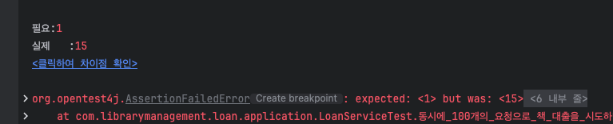

# 실행 방법

### 1. 필요한 환경
   - JDK 17 이상
   - Gradle 또는 Maven
   - MySQL, Redis 또는 Docker

### 2. 로컬 환경 설정
   (1) 데이터베이스 설정
   이 프로젝트는 MySQL과 Redis를 사용합니다.

   MySQL과 Redis가 로컬에 설치되어 있지 않다면, 도커를 사용하여 실행할 수 있습니다.

▶ MySQL 실행 (Docker)
```shell
docker run --name mysql-container -e MYSQL_ROOT_PASSWORD=password -e MYSQL_DATABASE=library -p 3306:3306 -d mysql:latest
```

▶ Redis 실행 (Docker)
```shell
docker run --name redis-container -p 6379:6379 -d redis:latest
```

▶ MySQL 수동 설정 (로컬 설치 시)
MySQL을 설치하고 실행

library 데이터베이스 생성
```sql
CREATE DATABASE library;
```

application.yml에 MySQL 사용자 정보(username, password) 추가

```yaml
server:
  port: 8080
  servlet:
    encoding:
      charset: utf-8

spring:
  data:
    redis:
      host: localhost
      port: 6379
  config:
    activate:
      on-profile: local
  datasource:
    driver-class-name: com.mysql.cj.jdbc.Driver
    url: jdbc:mysql://127.0.0.1:3306/library?socketTimeout=2000
    username: 
    password: 

    hikari:
      connection-timeout: 3000
  cache:
    type: redis

  h2:
    console:
      enabled: true
  jpa:
    open-in-view: false
    properties:
      hibernate:
        show_sql: true
        format_sql: true
  sql:
    init:
      mode: always
      schema-locations: classpath:schema.sql
      data-locations: classpath:data-local.sql
  main:
    allow-bean-definition-overriding: true

## Swagger 설정
springdoc:
  swagger-ui:
    path: /api-docs.html
  api-docs:
    path: /api-docs
  show-actuator: true
  default-produces-media-type: application/json

swagger:
  url: /swagger-ui/index.html#/
  host: http://localhost:8080

jwt:
  issuer: kimdongwoo
  secretKey: asdl;kjfas;lkdfvzcmvnqoeiruqopweurpoidaspoifuas;lkdjnflmnqwe.,mrn;as
```

# 3. 추가 고려사항

### 1. 동시에 여러명의 유저가 같은 도서를 대출 한다면

[LoanServiceTest.java](src/test/java/com/librarymanagement/loan/application/LoanServiceTest.java)

1. 100명의 유저가 동시에 하나의 책 대출 요청
2. 책 대출은 99권이 실패하고 1권만 성공 해야 함

테스트 결과



DB 반영 결과


15명이 같은 책을 동시에 대출이 가능해짐

동시성 처리
synchronize 키워드 vs Pessimistic Lock vs Redisson(분산락)
redisson은 성능이 좋지만 redis를 도입하는 리소스가 있음, 성능이 필요한 기능 까진 아님
synchronize는 ec2서버가 여러개 있다면 동시성 이슈를 막을 수 없음
Pessimistic Lock 은 성능 이슈와 데드락 이슈가 있음

이미 redis가 구축 되어있기 때문에 redisson으로 적용
[RedissonDistributedLockAop.java](src/main/java/com/librarymanagement/common/redisson/RedissonDistributedLockAop.java)

테스트 결과


DB 반영 결과


### 2. 검색, 태그 필터링을 하나의 동적 쿼리로
[BookQueryDslRepositoryImpl.java](src/main/java/com/librarymanagement/book/repository/BookQueryDslRepositoryImpl.java)

tagId가 존재하면 book_tag 테이블을 조인하여 태그 필터링 적용

검색어가 null이 아니고 빈 문자열이 아닐 경우만 검색 조건 추가


### 3. 인증 인가가 필요한 컨트롤러 메서드에 커스텀 어노테이션 적용

1. spring interceptor는 헤더에서 토큰을 추출하고, 토큰의 유효성을 검증하는 역할 [TokenInterceptor.java](src/main/java/com/librarymanagement/common/interceptor/TokenInterceptor.java)
2. spring argument resolver는 토큰에서 userId를 추출하는 역할 [UserIdentifierArgumentResolver.java](src/main/java/com/librarymanagement/common/resolver/UserIdentifierArgumentResolver.java)

커스텀 어노테이션인 @Authenticated [Authenticated.java](src/main/java/com/librarymanagement/common/interceptor/annotation/Authenticated.java)
을 spring intercpetor 에서 if (handlerMethod.hasMethodAnnotation(Authenticated.class)) 컨트롤러 메서드가 인증처리가 필요한 메서드인 경우에만 jwt 기반 인가를 하게 적용

커스텀 어노테이션인 @UserIdentifier [UserIdentifier.java](src/main/java/com/librarymanagement/common/resolver/annotation/UserIdentifier.java)
을 spring argument resolver 에서 return parameter.getParameterType().equals(Long.class) && parameter.hasParameterAnnotation(UserIdentifier.class);
컨트롤러 매개변수에 userId를 사용할 경우에만 jwt에서 userId를 추출해서 사용하게 적용


# 4. 추가 요구 사항 코드


**추가 요구사항 (선택 사항)**

1. 데이터 검증: 잘못된 데이터 입력(예: 누락된 필수 필드, 잘못된 데이터 형식)을 방지하는 유효성 검증 로직을 구현합니다.
   2. [AddTagToBookHttpRequest.java](src/main/java/com/librarymanagement/book/ui/dto/request/AddTagToBookHttpRequest.java)
   3. [CreateBookHttpRequest.java](src/main/java/com/librarymanagement/book/ui/dto/request/CreateBookHttpRequest.java)
   4. [updateBookHttpRequest.java](src/main/java/com/librarymanagement/book/ui/dto/request/updateBookHttpRequest.java)
   5. [CreateUserHttpRequest.java](src/main/java/com/librarymanagement/user/ui/dto/request/CreateUserHttpRequest.java)
   6. [SignInUserHttpRequest.java](src/main/java/com/librarymanagement/user/ui/dto/request/SignInUserHttpRequest.java)

2. 에러 처리: 유효하지 않은 요청, 존재하지 않는 리소스 접근 등의 경우 적절한 HTTP 상태 코드와 에러 메시지를 반환합니다.
   1. [EmailValidator.java](src/main/java/com/librarymanagement/user/domian/implementations/EmailValidator.java)
   2. [UserValidator.java](src/main/java/com/librarymanagement/user/domian/implementations/UserValidator.java)
   3. [LoanValidator.java](src/main/java/com/librarymanagement/loan/domain/implementations/LoanValidator.java)
   4. [BookValidator.java](src/main/java/com/librarymanagement/book/domain/implementations/BookValidator.java)
   5. [BookTagValidator.java](src/main/java/com/librarymanagement/tag/domain/implementations/BookTagValidator.java)

3. 검색 기능: 도서 제목 또는 저자 이름으로 도서를 검색하는 기능을 추가합니다.
   1. 쿼리: [BookQueryDslRepositoryImpl.java](src/main/java/com/librarymanagement/book/repository/BookQueryDslRepositoryImpl.java)


4. 페이징 및 정렬: 도서 목록 조회 시, 결과를 페이지로 나누고 제목 또는 출판일을 기준으로 정렬할 수 있는 기능을 제공합니다.
   1. 쿼리: [BookQueryDslRepositoryImpl.java](src/main/java/com/librarymanagement/book/repository/BookQueryDslRepositoryImpl.java)
   2. 페이징 변환: [Converter.java](src/main/java/com/librarymanagement/common/dto/Converter.java)
   

5. 태그 기반 필터링: 도서에 태그를 추가하고 태그로 도서를 필터링할 수 있는 기능을 구현합니다.
   1. 태그 추가, 조회: [TagController.java](src/main/java/com/librarymanagement/tag/ui/TagController.java)
   2. 도서에 태그 추가: [BookController.java](src/main/java/com/librarymanagement/book/ui/BookController.java).addTagToBook
   3. 필터링 쿼리: [BookQueryDslRepositoryImpl.java](src/main/java/com/librarymanagement/book/repository/BookQueryDslRepositoryImpl.java)

6. JWT 기반 인증/인가: 사용자가 API를 호출하기 위해 로그인하고, 권한이 필요한 작업을 수행하도록 JWT 인증을 구현합니다.
   1. 인가: [AuthService.java](src/main/java/com/librarymanagement/auth/application/AuthService.java)
   2. 토큰 발급, 검증: [JwtProvider.java](src/main/java/com/librarymanagement/auth/domain/JwtProvider.java)
   3. 헤더에서 토큰 추출, 토큰 유효성 검증: [TokenInterceptor.java](src/main/java/com/librarymanagement/common/interceptor/TokenInterceptor.java)
   4. 토큰에서 userId 추출: [UserIdentifierArgumentResolver.java](src/main/java/com/librarymanagement/common/resolver/UserIdentifierArgumentResolver.java)